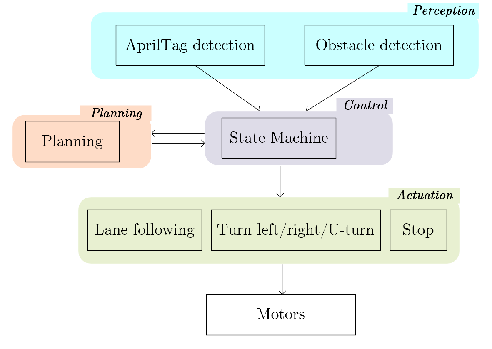
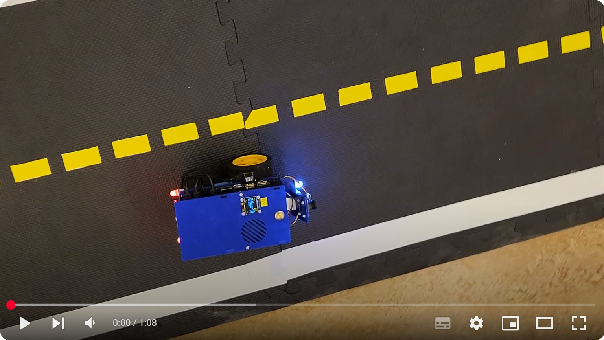
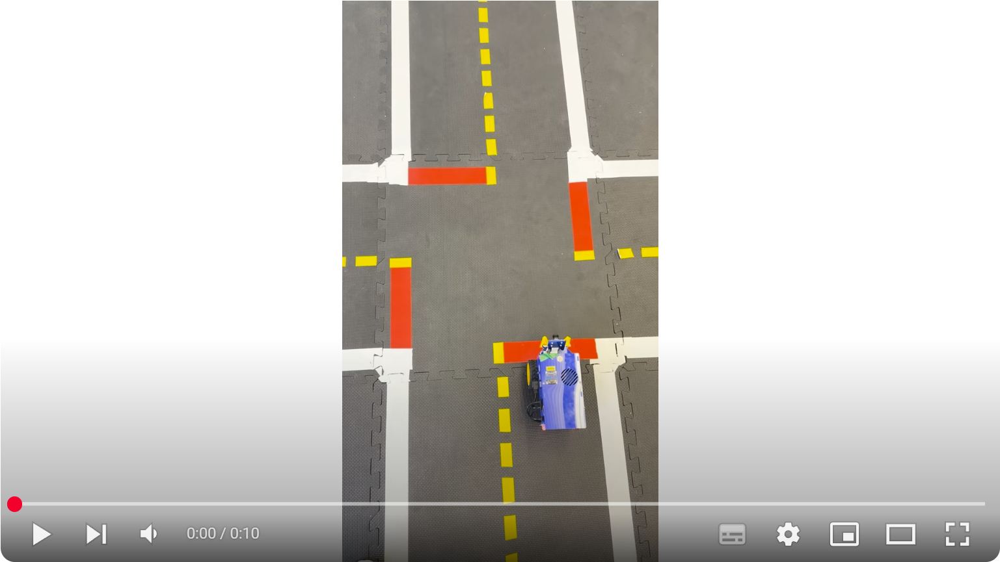
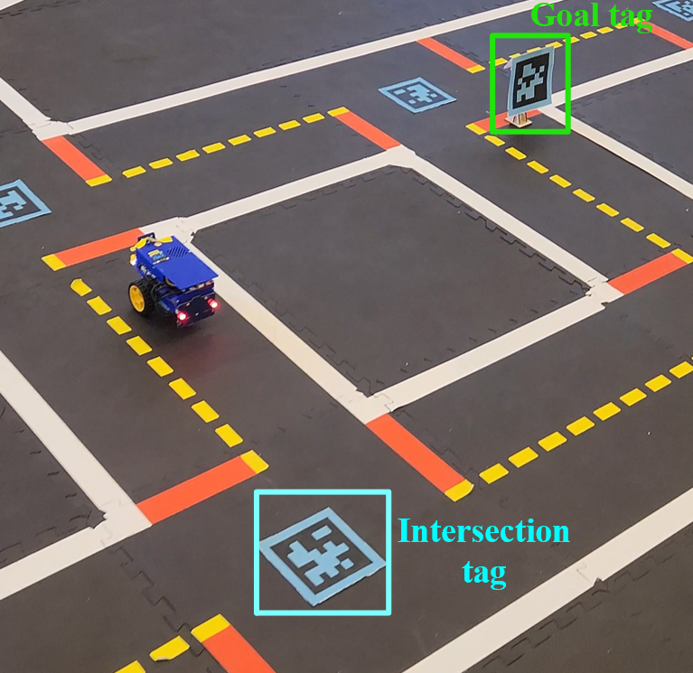
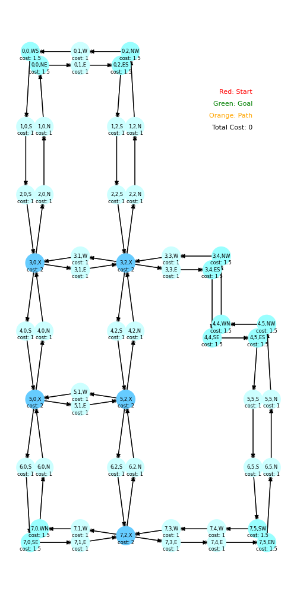
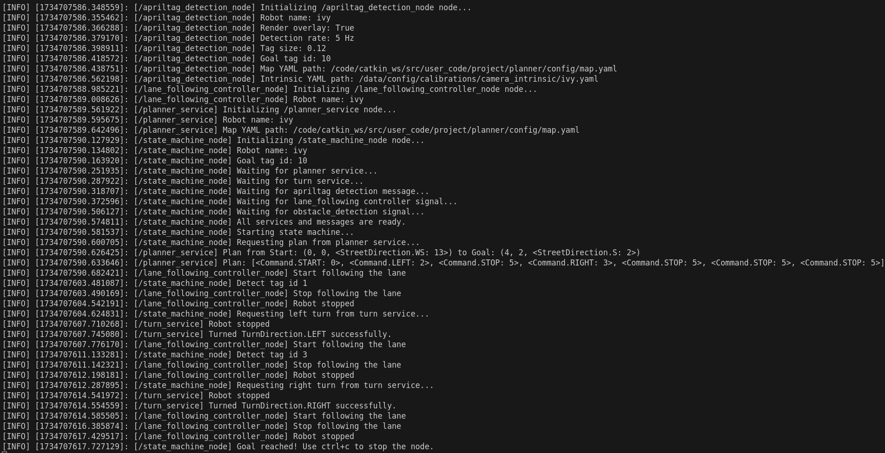
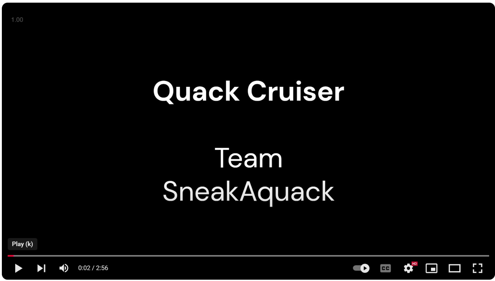

# DuckieTown
This repo is set for DuckieTown project QuackCruiser at ETH 2024Fall.

## :open_file_folder: Package list
For package details, refer to the README in each package folder.


- `apriltag_detection`: Tag detection for crossing localization and goal check
- `obstacle_detection`: Obstacle detection if close enough
- `planner`: Map encoding and ROS service for Dijkstra's shortest path
- `lane_following_controller`: Wrapper for lane_following in `dt-core`
- `turning`: ROS service for turning left/right/U-turn at crossings and for stopping
- `state machine`: Control and coordinate the robot's navigation through
- `darknet_ros`: Cloned and configured from [YOLO-ROS](https://github.com/leggedrobotics/darknet_ros) for object detection in image frame

## :gear: How to set up the repo
In ssh out of container:  
`$ cd ~/vnc-docker/user_code_mount_dir`  
`$ git clone git@github.com:li-yunwen/DuckieTown.git project`  
`$ nano ~/.bashrc`, add `export VEHICLE_NAME="[YOUR_ROBOT_NAME]"`.  
This will export your robot's name [YOUR_ROBOT_NAME] to the environment in new terminals.  

In container, build the project and install pip dependencies:  
`$ cd /code/catkin_ws`  
`$ catkin build`  
`$ source devel/setup.bash`  
`$ cd src/user_code/project`  
`$ pip install -r pip_requirements.txt`  

Now, we need to set up [YOLO-ROS](https://github.com/leggedrobotics/darknet_ros) on duckie. It is already included in this repo, so do not clone it from the link. We have configured the Makefile to compile with CUDA.  
1. In container,
`$ nano ~/.bashrc`, add
```
export PATH=/usr/local/cuda-10.2/bin:$PATH
export LD_LIBRARY_PATH=/usr/local/cuda/lib64:$LD_LIBRARY_PATH
export CUDA_HOME=$CUDA_HOME:/usr/local/cuda-10.2
```
2. In container, install the required gcc-8 and build the package,
```
$ sudo apt install gcc-8 g++-8
$ sudo update-alternatives --install /usr/bin/gcc gcc /usr/bin/gcc-8 80
$ sudo update-alternatives --install /usr/bin/g++ g++ /usr/bin/g++-8 80
$ cd /code/catkin_ws/src/user_code/project/darknet_ros/darknet
$ make
$ cd /code/catkin_ws
$ catkin build
$ catkin build darknet_ros -DCMAKE_BUILD_TYPE=Release
$ source devel/setup.bash
$ cd /code/catkin_ws/src/user_code/project/darknet_ros/darknet_ros/yolo_network_config/weights
$ wget http://pjreddie.com/media/files/yolov3-tiny.weights
```
3. Open `/code/catkin_ws/src/user_code/project/darknet_ros/darknet_ros/config/ros.yaml`:  
change `camera_reading: topic` according to your robot's name and your image input topic.  

4. launch:  
`$ roslaunch darknet_ros darknet_ros.launch` 
This launch file also includes a launch of our **BGR to RGB** node. You can also configure it to use different yolo weights other than yolo3-tiny.


## :wrench: How to calibrate the duckie
Before proceeding, calibrate the wheels and the camera:  
1. Perform wheel calibration according to [the tutorial](https://docs.duckietown.com/ente/opmanual-duckiebot/operations/calibration_wheels/index.html).
2. Perform camera calibration according to [the tutorial](https://github.com/ETHZ-DT-Class/camera-calibration-tools?tab=readme-ov-file).

## :chart_with_upwards_trend: How to tune parameters
There are two sets of parameters to be tuned for each duckie:  
#### Lane Following:  
To test lane following:  
1. In ssh outside container, bring up `dt-core`:  
`$ cd /home/duckie/vnc-docker/user_code_mount_dir/project/lane_following_controller/bash_scripts`  
`$ ./bringup_dt_core.sh` 
2. In main-workspace container, signal start lane following:  
`$ cd /code/catkin_ws/src/user_code/project/lane_following_controller/bash_scripts`  
`$ ./stop_lane_following.sh`  
The detection quality can be visualize using `rqt_image_view` in RealVNC. While the controller quality can be observed from steering behavior.

To tune lane following, the following files should be adjusted:
1. `lane_following_controller/config/default_control.yaml`:  
This file contains PID parameters for lane following in `dt-core`.
2. `lane_following_controller/config/default.yaml`:  
This file contains detection thresholds for lane detection in `dt-core`.

To test the tuning:
1. Stop lane following in main-workspace:
`$ ./stop_lane_following.sh`
2. Shut down and bring up dt-core again in ssh outside container.

After successful tuning, if wheel motors function properly, you should expect the car to almost always stay in the lane. It is recommended to keep the velocity `v_bar` slow.

[](https://youtu.be/RuMyj4vDQsw)

#### Turning Service:
To test the turning ROS service, put the car at a crossing's stop line, then in main-workspace,  
`$ rosrun turning turn_service.py`
In another terminal,  
- to test left turn: `$ rosservice call /[ROBOT_NAME]/turn_service "direction: 1"`
- to test right turn: `$ rosservice call /[ROBOT_NAME]/turn_service "direction: 2"`
- to test U-turn: `$ rosservice call /[ROBOT_NAME]/turn_service "direction: 3"`

To tune turning, open `turning/src/turning/turn_service.py`, adjust `VELOCITY, RADUIS, TURN_TIME` for each direction at the top of the file.  

To test the tuning, shut down `turn_service` and re-run the service.

After successful tuning, you should expect the turns to be accurate with 25° tolerance for the final heading.
[](https://youtube.com/watch/SwEF1Te3brw)


## :rocket: How to run the full demo
1. Set up the DuckieTown environment:   

Uniques tags should be put at each crossing and at the goal grid. For detailed rules, refer to the [README](apriltag_detection/README.md) in apriltag_detection.  


Each intersection tag defines a specific crosssing, they are specified in `planner/config/map.yaml` generated by `planner/config/generate_map.py`. You can adjust the static map, the tag ids, and their corresponding grids in `generate_map.py`:  
`$ cd /code/catkin_ws/src/user_code/project/planner/config/generate_map.py`  
`$ python3 generate_map.py`

The goal tag id is defined in `state_machine/launch/state_machine.launch`:  
`<param name="/$(env VEHICLE_NAME)/goal_tag_id" value="10" />`

2. Set the desired start grid, goal grid, and goal tag id in `state_machine/launch/state_machine.launch`:  
```
<param name="start_grid_coords_dir" value="[0, 0, 'WS']" />
<param name="goal_grid_coords_dir" value="[4, 2, 'S']" />
```
For the grid coordinates and heading directions, please refer to the map in `planner/config/map_graph.png`:  


3. In ssh outside container, bring up `dt-core` image to prepare for lane following:  
`$ cd /home/duckie/vnc-docker/user_code_mount_dir/project/lane_following_controller/bash_scripts`  
`$ ./bringup_dt_core.sh`  

4. In `main-workspace` container, bring up YOLO-ROS:  
`$ roslaunch darknet_ros darknet_ros.launch`

5. Wait until step 3 and 4 get fully initialized.  

6. In `main-workspace` container, bring up the demo:  
`$ roslaunch state_machine state_machine.launch`

## :pencil: Expected sample terminal log


## :clapper: Expected demo operation
[](https://youtu.be/y8ITnMAu1iU)
