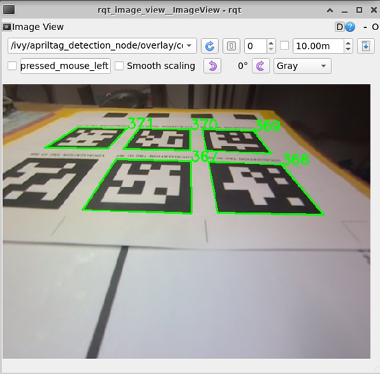

# DuckieTown
This repo is set for DuckieTown project QuackCruiser at ETH 2024Fall.
## :gear: How to set up the repo
In ssh out of container:  
`$ cd ~/vnc-docker/user_code_mount_dir`  
`$ git clone git@github.com:li-yunwen/DuckieTown.git project`  
`$ nano ~/.bashrc`, add `export VEHICLE_NAME="[YOUR_ROBOT_NAME]"`.  
This will export your robot's name [YOUR_ROBOT_NAME] to the environment in new terminals.  
To update the latest repo:  
`$ git pull` 

In container:  
`$ cd /code/catkin_ws`  
`$ catkin build`  
`$ source devel/setup.bash`  
`$ cd src/user_code/project`  
`$ pip install -r pip_requirements.txt`  


## :hammer_and_wrench: How to develop
**Always list the pip installed environment in pip_requirements.txt.**  
:balance_scale: Keep everthing in SI unit, e.g., m, rad, sec.  

Always read robot_name from env instead of hardcode it in the node script:
```
self.robot_name = os.getenv('VEHICLE_NAME', None)
if self.robot_name is None:
    raise ValueError("$VEHICLE_NAME is not set, export it first.")
rospy.loginfo("Robot name: %s", self.robot_name)
```
Always read robot_name from env instead of hardcode it in the launch script:
```
<arg name="camera_intrinsics_yaml_path" default="/data/config/calibrations/camera_intrinsic/$(env VEHICLE_NAME).yaml" />
```

#### TODO list:
:black_square_button: Tune `lane_following_controller/config/default.yaml` for lane following:  
1. Bring up dt-core as instructed in Lane Following below  
2. In RealVNC, use `$ rqt_image_view` to subscribe to different images and check the quality of lane detection
3. Modify parameters in `lane_following_controller/config/default.yaml` accordingly
4. Shut down dt-core and re-bringup to validate your changes

:black_square_button: Test the start and stop of lane following node  
:black_square_button: The node for turn left/right/Uturn  
:black_square_button: The state machine node  
:black_square_button: The obstacle detection node  
:black_square_button: The obstacle avoidance node  

## :rocket: How to run  
Don't forget to source `devel/setup.bash` in RealVNC terminals if you cannot locate a package.

Don't forget to `chmod +x` for shell scripts and python files.  

#### :eyes: AprilTag Detection (apriltag_detection)
1. Perform camera calibration according to [the tutorial](https://github.com/ETHZ-DT-Class/camera-calibration-tools?tab=readme-ov-file).

2. launch:  
`roslaunch apriltag_detection apriltag_detection.launch`

3. You should then be able to echo the topic `/[ROBOT_NAME]/apriltag_detection_node/tag_info`. You can visualize `/[ROBOT_NAME]/apriltag_detection_node/tag_info/overlay/compressed` using `$ rqt_image_view` in RealVNC:  


#### :motorway: Lane Following (lane_following_controller)
1. Perform wheel calibration according to [the tutorial](https://docs.duckietown.com/ente/opmanual-duckiebot/operations/calibration_wheels/index.html).
2. To start:  
In ssh out of container, bring up dt-core:  
`$ cd /home/duckie/vnc-docker/user_code_mount_dir/project/lane_following_controller/bash_scripts`  
`$ ./bringup_dt_core.sh`  
In main-workspace container, signal start lane following:  
`$ cd /code/catkin_ws/src/user_code/project/lane_following_controller/bash_scripts`  
`$ ./start_lane_follwing.sh`
3. To stop:  
In main-workspace container, signal stop lane follwing:  
`$ cd /code/catkin_ws/src/user_code/project/lane_following_controller/bash_scripts`  
`$ ./stop_lane_follwing.sh`
In ssh out of container, shut down dt-core:  
`$ cd /home/duckie/vnc-docker/user_code_mount_dir/project/lane_following_controller/bash_scripts`  
`$ ./shutdown_dt_core.sh`  

#### :pencil: Planner (planner)
Dijkstra with direction of streets encoded. Images to be included. (TODO)

#### :mag_right: Obstacle Detection
:black_square_button:TODO: COPYRIGHT of the repo
Set up [darknet_ros](https://github.com/leggedrobotics/darknet_ros) on duckie:  
1. In container,
`$ nano ~/.bashrc`, add
```
export PATH=/usr/local/cuda-10.2/bin:$PATH
export LD_LIBRARY_PATH=/usr/local/cuda/lib64:$LD_LIBRARY_PATH
export CUDA_HOME=$CUDA_HOME:/usr/local/cuda-10.2
```
2. In container,
```
$ sudo apt install gcc-8 g++-8
$ sudo ln -s /usr/bin/gcc-8 /usr/local/cuda-10.2/bin/gcc 
$ sudo ln -s /usr/bin/g++-8 /usr/local/cuda-10.2/bin/g++
$ sudo update-alternatives --install /usr/bin/gcc gcc /usr/bin/gcc-8 80
$ sudo update-alternatives --install /usr/bin/g++ g++ /usr/bin/g++-8 80
$ cd /code/catkin_ws/src/user_code/project/darknet_ros/darknet
$ make
$ cd /code/catkin_ws
$ catkin build
$ catkin build darknet_ros -DCMAKE_BUILD_TYPE=Release
$ source devel/setup.bash
$ cd /code/catkin_ws/src/user_code/project/darknet_ros/darknet_ros/yolo_network_config/weights
$ wget http://pjreddie.com/media/files/yolov3-tiny.weights
```
3. launch:  
`roslaunch darknet_ros darknet_ros.launch`
