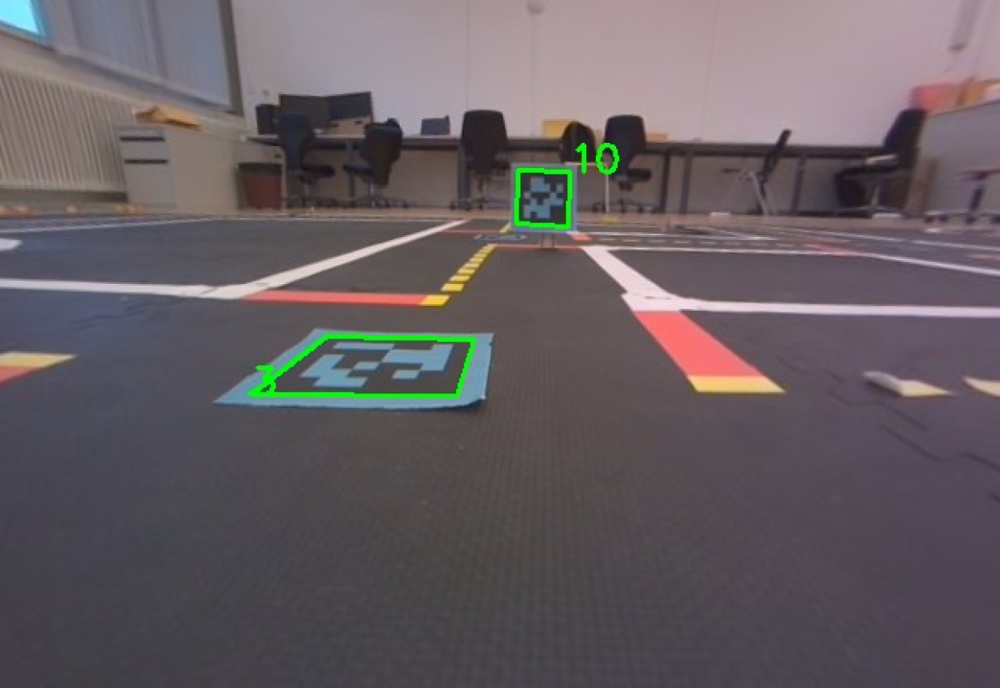

# :mag_right: AprilTag Detection (apriltag_detection)
This package is used for localization of the robot at crossings and for the goal check. 

The tag ids at crossings are defined in `planner/config/map.yaml` generated by `planner/config/generate_map.py`. Modify and run `generate_map.py` according to your environment set up. The goal tag id should be defined in `state_machine/launch/state_machine.launch`. 

To test this package:
1. Perform camera calibration according to [the tutorial](https://github.com/ETHZ-DT-Class/camera-calibration-tools?tab=readme-ov-file).

2. launch:  
`roslaunch apriltag_detection apriltag_detection.launch`

3. You can now visualize `/[ROBOT_NAME]/apriltag_detection_node/tag_info/overlay/compressed` using `$ rqt_image_view` in RealVNC. **Only valid tag ids on the map (crossing ids, goal id) will be detected and published.**

You should be able to echo the topic `/[ROBOT_NAME]/apriltag_detection_node/tag_info`. This is the information from the cloest detected tag. In the sample image above, it contains information about the tag id 3 at the crossing.

To generate AprilTags with blue background, you can modify `../README_asset/tag_svgs/generate_apriltag_colorful.py`.

**Tags at crossings should use unique ids counting up from 1.** E.g., if there are 3 crossings, the crossing ids should be 1, 2, 3 because we use tag id as the index to retrieve the command from the optimal command list `[START, optimal stratedy at crossing id 1, optimal stratedy at crossing id 2, optimal stratedy at crossing id 3, STOP]`.