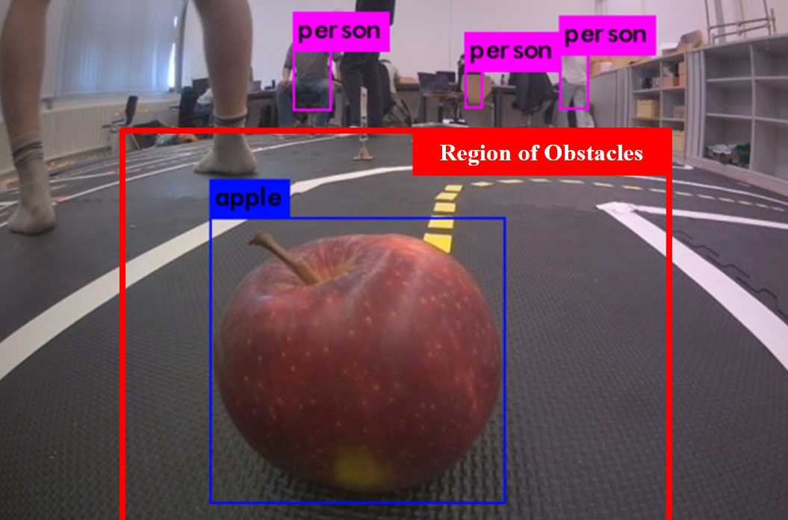

# :eyes: Obstacle Detection (obstacle_detection & darknet_ros)
This package is used for obstacle detection.

To test the obstacle detection, make sure that the `camera: topic:` is correct in `darknet_ros/darknet_ros/config/ros.yaml`.

Run:  
`$ roslaunch darknet_ros darknet_ros.launch`
A YOLO window should pop up in RealVNC. 

The public yolov3-tiny weight is used. You can adjust the weight choice in `darknet_ros.launch`. A BGR to RGB node is included since YOLO-ROS inputs RGB. The conversion rate is decreased to 5Hz to reduce latency.

YOLO detects the pixel bounding boxes for objects. We thereby detect obstacles in the image frame if they appear within the central lower region as marked red below.

     

A more elegant way would be to do ground projection for the lower edge of the bounding box, so we would know the obstacles's position in the robot frame and could deal with obstacles of different sizes.