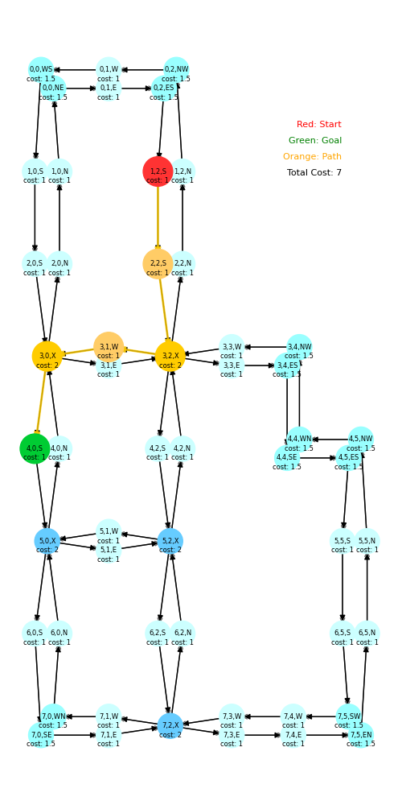
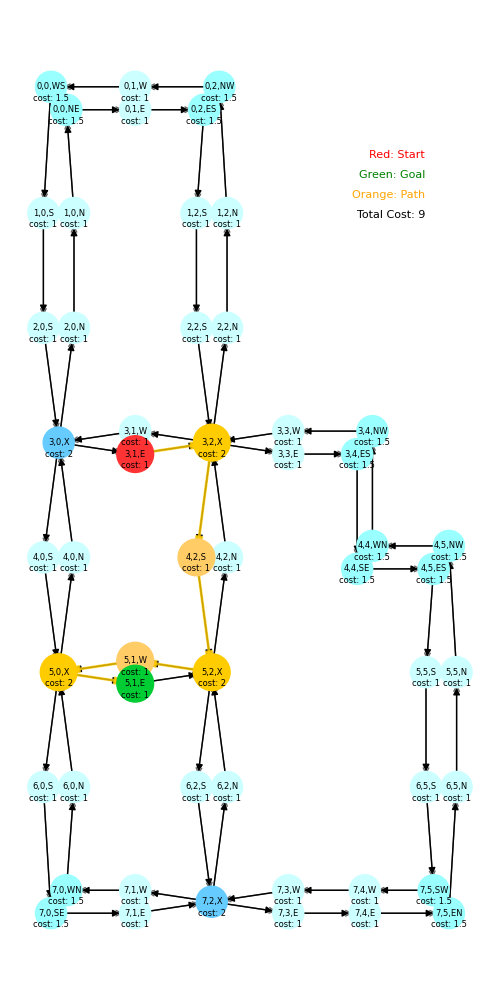
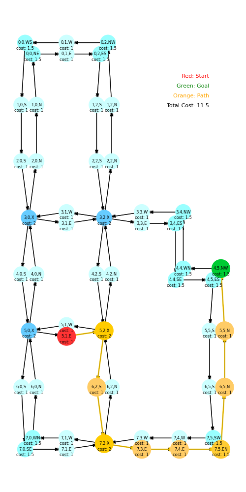
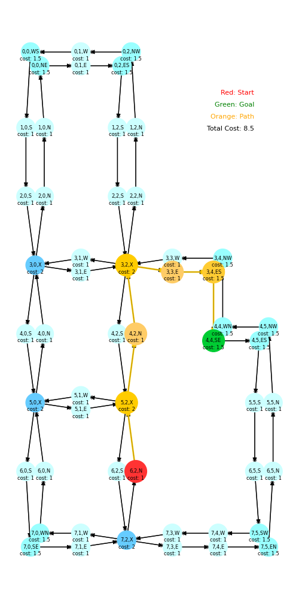

# :pencil: Path planning (planner)
The node `planner_service` provides a ROS service for shortest path planning from a start to a goal grid, with heading directions specified. The planning will be requested by the state machine and will return the optimal driving stratedy for all crossings.

We encode the static map as a bidirection gridized map. Therefore, the robot can start or stop at any grid with specified heading direction. The encoded map is easily adaptable to changes in the actual map since it is generated using script and a user-defined 2D grid occupancy array. You can configure it in by modifying and running `planner/config/generate_map.py`, which generates the `planner/config/map.yaml`.

Dijkstra's shortest path algorithm is used, provided by `networkx`.

  
  
  
  

