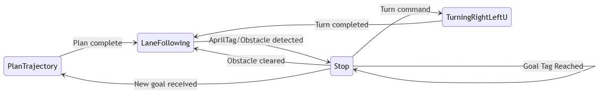

# :link: State Machine (state_machine)
This package is used for coordination of all nodes.

The workflow is as follows:  
-  First, the robot is waiting at *PlanTrajectory* state. Given an initial position and a goal on the map, the planner ROS service is called, and the optimal driving stratedy for each crossing was generated. 
- Then the robot moves to the *Lane Following* state. 
- Upon reaching an crossing, the robot will detect a specific AprilTag standing for that crossing. According to the optimal stratedy, if the robot should make a turn, the state changes to *Stop*. 
- After lane following stops, the robot will move to the *Turning* state. This compromises either a right, left, or U-turn according to optimal stratedy. After the turning ROS service completes, the robot continues *Lane Following*. 
- The *Stop* state will also be triggered if an obstacle is observed or the goal tag id is detected close enough.